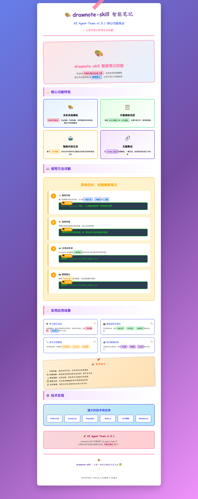

# 🤖 AI Agent Team

<div align="center">


**🚀 拥有24/7专业AI开发团队：产品经理、前端开发、后端开发、测试工程师、DevOps工程师、技术负责人**

`npm install -g ai-agent-team` 一键安装，开发效率飙升200%！

</div>

## 🎨 DrawNote Skill - 智能笔记可视化核心功能

> **✨ 让您的笔记变得生动有趣！将文字内容转换为精美图片**

### 🌟 核心功能特色

| 🎨 多彩风格模板 | 📋 内置模板系统 | 🤖 智能内容生成 | 🔗 无缝集成 |
|--------------|--------------|--------------|----------|
| **彩色手写笔记**、专业商务、科技创新、自然清新等多种风格 | 内置**提示词模板**和**样式模板**，无需外部文件 | 基于**AI大模型**，自动分析内容并生成最适合的笔记结构 | 与**Claude Code**完美集成，一键生成，自动保存 |

### 📝 使用方法详解

#### 简单四步，创建精美笔记

1. **📝 提供内容**
   ```bash
   skill: "drawnote"
   内容: "人工智能发展历程" 或具体笔记内容
   ```

2. **🎨 选择风格**
   ```bash
   "请使用彩色手写笔记风格" 或 "请生成学习笔记风格的信息图"
   ```

3. **🤖 AI自动生成**
   ```bash
   自动保存: drawnote_YYYYMMDD_HHMMSS.html
   ```

4. **📸 截图输出**
   ```bash
   自动保存: drawnote_YYYYMMDD_HHMMSS.png
   ```

### 💡 实用应用场景

| 📚 学习笔记总结 | 💼 商务报告可视化 | 🔧 技术文档整理 | 📊 知识梳理总结 |
|--------------|----------------|--------------|---------------|
| **荧光笔高亮**、彩色标注等学习元素 | **数据分析**、项目报告、战略规划 | **技术架构**、API文档、开发指南 | **时间线**、流程图、对比表等形式 |

### 🎯 五种精美风格

1. **彩色手写笔记风格** ⭐ 推荐
   - 适用场景：学习笔记、读书总结、知识整理
   - 特点：温馨自然、易于记忆

2. **专业商务风格**（默认）
   - 适用场景：商业报告、数据分析、项目演示
   - 特点：简洁专业、数据驱动

3. **科技创新风格**
   - 适用场景：技术文档、产品介绍、创新展示
   - 特点：现代科技、未来感强

4. **自然清新风格**
   - 适用场景：环保主题、健康生活、自然科学
   - 特点：清新淡雅、亲和力强

5. **现代简约风格**
   - 适用场景：极简设计、艺术展示、高端品牌
   - 特点：简约大气、设计感强

### 📸 实际效果展示



*上图为 AI Agent Team v1.0.1 的 DrawNote Skill 实际生成效果，展示了核心功能和应用场景的 2x2 网格布局*

---

## ✨ 特性亮点

- 🎯 **六大专业智能体** - 产品经理、前端开发、后端开发、测试工程师、DevOps工程师、技术负责人
- ⚡ **原生集成** - 完全基于Claude Code的原生智能体系统
- 🚀 **快捷命令** - 简化的命令行调用方式，提升开发效率
- 🔄 **完整工作流** - 支持完整的产品开发流程和团队协作
- 📚 **详细文档** - 包含使用指南、最佳实践和示例
- 🛠️ **易于扩展** - 模块化设计，支持自定义智能体
- 🎨 **DrawNote Skill** - 智能笔记可视化，让内容更生动

## 🚀 快速开始

### 系统要求

- Claude Code (已安装并配置)
- Node.js 16+ (可选，用于高级功能)
- Git

### 安装步骤

1. **克隆仓库**
```bash
git clone https://github.com/peterfei/ai-agent-team.git
cd ai-agent-team
```

2. **安装智能体配置**
```bash
# 复制智能体配置到您的Claude配置目录
cp -r .claude/* ~/.claude/
```

3. **验证安装**
```bash
# 测试智能体是否正常工作
claude -p "/agent product_manager '测试功能'"
```

### 快速使用

#### 🎨 DrawNote Skill 使用示例

```bash
# 基础使用
请帮我创建一个关于"人工智能发展历程"的信息图

# 指定风格
请使用彩色手写笔记风格生成"机器学习算法分类"的信息图

# 复杂内容
请创建一个关于"微服务架构设计模式"的流程图，使用科技创新风格

# 学习笔记
请用专业商务风格创建"React Hooks"的技术文档

# 知识总结
请创建一个关于"Python数据结构"的学习总结，使用自然清新风格
```

#### 🤖 AI 智能体使用示例

```bash
# 产品经理 - 需求分析
/pm "设计用户认证系统"

# 前端开发 - UI实现
/fe "创建登录页面组件"

# 后端开发 - API开发
/be "实现JWT认证接口"

# 测试工程师 - 质量保证
/qa "测试用户认证流程"

# 运维工程师 - 部署运维
/ops "部署到生产环境"

# 技术负责人 - 架构设计
/tl "评估系统架构"
```

## 🎨 DrawNote Skill - 核心特色功能

DrawNote Skill 是 AI Agent Team v1.0.1 的核心特色功能，提供专业的智能笔记与流程图绘制能力。

### 🚀 核心功能

- 📝 **学习笔记可视化** - 将文字内容转化为精美的视觉笔记
- 🗺️ **知识梳理与总结** - 自动生成思维导图和信息图
- 📊 **流程图绘制** - 快速创建专业流程图和架构图
- 💡 **概念解释图表** - 复杂概念可视化呈现

### 🎯 技术特点

- **基于 Playwright** - 高质量截图引擎，自动生成 HTML 和 PNG 双格式文件
- **智能布局算法** - 自适应内容，确保最佳的视觉效果
- **内置模板系统** - 无需外部文件，使用更便捷
- **无缝集成** - 与 Claude Code 完美集成，一键生成

### 📸 实际效果


*上图为 DrawNote Skill 生成的彩色手写笔记风格示例，展示了 AI Agent Team v1.0.1 的核心功能*

## 📋 智能体角色

### 🎯 产品经理 (`/pm`)
- **职责**: 产品规划、需求分析、用户研究、竞品分析
- **专长**: 敏捷开发、路线图制定、利益相关者管理
- **使用场景**: 功能需求分析、产品规划、用户体验设计

### 🎨 前端开发 (`/fe`)
- **职责**: UI实现、组件开发、用户体验优化
- **专长**: React/Vue/Angular、响应式设计、性能优化
- **使用场景**: 页面开发、组件设计、前端架构

### ⚙️ 后端开发 (`/be`)
- **职责**: API设计、数据库优化、服务器端逻辑
- **专长**: Node.js/Python/Java、数据库设计、API架构
- **使用场景**: API开发、数据库设计、系统集成

### 🧪 测试工程师 (`/qa`)
- **职责**: 功能测试、自动化测试、质量保证
- **专长**: 单元测试、集成测试、端到端测试
- **使用场景**: 测试设计、自动化测试、缺陷管理

### 🔧 DevOps工程师 (`/ops`)
- **职责**: 部署运维、基础设施、CI/CD流水线
- **专长**: Docker、Kubernetes、云服务、监控告警
- **使用场景**: 系统部署、运维监控、性能优化

### 👨‍💼 技术负责人 (`/tl`)
- **职责**: 技术决策、团队协调、架构设计
- **专长**: 系统架构、技术选型、团队管理
- **使用场景**: 架构评审、技术选型、团队规划

## 💼 工作流程示例

### 完整产品开发流程

```bash
# 1. 需求分析阶段
/pm "分析用户认证系统需求，包括功能规格、用户故事和验收标准"

# 2. 技术设计阶段
/tl "设计用户认证系统的技术架构，包括前后端分离、JWT认证、数据库设计"

# 3. 后端开发阶段
/be "实现JWT认证API，包括登录、注册、token刷新功能"

# 4. 前端开发阶段
/fe "创建React登录组件，包含表单验证、错误处理和响应式设计"

# 5. 测试验证阶段
/qa "设计用户认证系统的完整测试用例，包括功能测试和安全测试"

# 6. 部署上线阶段
/ops "配置用户认证系统的生产环境部署，包括Docker容器化和CI/CD流水线"
```

### 并行开发模式

```bash
# 需求定义
/pm "分析实时协作功能需求"

# 并行开发
/be "构建WebSocket实时协作API" &
/fe "创建协作编辑界面" &

# 等待前后端开发完成
wait

# 集成测试
/qa "测试实时协作端到端流程"

# 部署
/ops "部署协作功能到生产环境"
```

## 🛠️ CLI工具

项目包含一个便捷的CLI工具，提供更友好的命令行界面：

```bash
# 使用CLI工具调用智能体
./.claude/agents/cli.sh pm "设计用户认证系统"
./.claude/agents/cli.sh 前端 "创建登录页面"
./.claude/agents/cli.sh backend "实现JWT API"
./.claude/agents/cli.sh 测试 "测试认证流程"
./.claude/agents/cli.sh 运维 "部署到生产环境"
```

CLI工具特性：
- 🎨 彩色输出界面
- 🔍 智能体名称映射（支持中英文）
- 💡 下一步建议
- ❌ 错误处理和帮助信息
- 📊 调试模式支持

## 📁 项目结构

```
ai-agent-team/
├── .claude/
│   ├── agents/                  # 智能体配置文件
│   │   ├── product_manager.md   # 产品经理智能体
│   │   ├── frontend_dev.md      # 前端开发智能体
│   │   ├── backend_dev.md       # 后端开发智能体
│   │   ├── qa_engineer.md       # 测试工程师智能体
│   │   ├── devops_engineer.md   # 运维工程师智能体
│   │   ├── tech-leader.md       # 技术负责人智能体
│   │   └── cli.sh / cli.ps1     # CLI工具脚本
│   ├── commands/               # 快捷命令配置
│   │   ├── pm.md              # 产品经理快捷命令
│   │   ├── fe.md              # 前端开发快捷命令
│   │   ├── be.md              # 后端开发快捷命令
│   │   ├── qa.md              # 测试工程师快捷命令
│   │   ├── ops.md             # 运维工程师快捷命令
│   │   ├── tl.md              # 技术负责人快捷命令
│   │   └── README.md          # 命令说明文档
│   ├── skills/                 # Skills 目录
│   │   └── drawnote/          # DrawNote Skill
│   │       ├── SKILL.md       # Skill 定义
│   │       ├── package.json   # 依赖配置
│   │       ├── scripts/       # 脚本目录
│   │       └── styles/        # 风格模板
│   ├── CLAUDE.md              # 项目说明文档
│   └── USAGE.md               # 详细使用指南
├── bin/                       # CLI 工具
│   └── ai-agent-team.js      # CLI 主程序
├── scripts/                   # 辅助脚本
│   ├── postinstall.js        # npm postinstall
│   ├── preinstall.js         # npm preinstall
│   └── install.sh            # 安装脚本
├── docs/                      # 文档目录
│   ├── BEST_PRACTICES.md      # 最佳实践指南
│   ├── EXAMPLES.md            # 使用示例
│   ├── TROUBLESHOOTING.md     # 故障排除指南
│   └── CUSTOM_AGENTS.md       # 自定义智能体指南
├── examples/                  # 示例项目
│   ├── web-app/               # Web应用开发示例
│   ├── mobile-app/            # 移动应用开发示例
│   └── api-service/           # API服务开发示例
├── package.json               # npm包配置
├── README.md                  # 项目说明
├── GITHUB_README.md           # GitHub展示文档
├── LICENSE                    # 开源许可证
├── CONTRIBUTING.md            # 贡献指南
├── CHANGELOG.md               # 更新日志
├── install.sh                 # Shell安装脚本 (macOS/Linux)
├── install.ps1                # PowerShell安装脚本 (Windows)
└── install.bat                # 批处理安装脚本 (Windows)
```

## 🎯 使用场景

### 1. 个人开发者
- 快速原型开发
- 全栈项目开发
- 技术学习参考

### 2. 初创团队
- MVP快速开发
- 团队协作规范
- 技术选型指导

### 3. 企业开发
- 标准化开发流程
- 新人培训
- 最佳实践推广

### 4. 教育培训
- 编程教学辅助
- 项目实战指导
- 团队协作培训

## 📈 最佳实践

### 1. 清晰的任务描述
```bash
# 好的示例
/pm "为电商网站设计购物车功能，包括添加商品、数量调整、价格计算和结算流程"

# 避免模糊描述
/pm "做个购物车"
```

### 2. 提供上下文信息
```bash
# 包含项目背景
/be "基于我们现有的Express.js用户系统，添加OAuth2集成功能"
```

### 3. 迭代式开发
```bash
# 分阶段实施
/pm "第一阶段：设计用户认证的MVP功能"
/be "第一阶段：实现基础的注册和登录API"
/fe "第一阶段：创建简单的登录表单"
```

### 4. 团队协作
```bash
# 确保智能体间的工作协调
/fe "基于产品需求文档和后端API设计，创建用户界面"
/qa "测试前端界面与后端API的完整集成"
```

## 🔧 高级配置

### 自定义智能体

1. 创建智能体配置文件：
```bash
cp .claude/agents/product_manager.md .claude/agents/custom_agent.md
```

2. 编辑配置文件，修改角色和能力
3. 创建对应的快捷命令：
```bash
cp .claude/commands/pm.md .claude/commands/custom.md
```

### 环境变量配置
```bash
# Claude Code配置
export CLAUDE_API_KEY="your-api-key"
export CLAUDE_MODEL="claude-3-sonnet"

# 智能体配置
export AGENT_TIMEOUT=300
export AGENT_MAX_TOKENS=4000
```

## ❓ 常见问题

<details>
<summary>智能体无响应怎么办？</summary>

1. 检查Claude Code是否正确安装：`claude --version`
2. 验证配置文件是否存在：`ls ~/.claude/agents/`
3. 测试基础功能：`claude -p "测试连接"`
4. 重新安装配置：`./scripts/install.sh`
</details>

<details>
<summary>如何提高任务完成质量？</summary>

1. 提供详细的任务描述和上下文
2. 分步骤分解复杂任务
3. 明确指定技术栈和约束条件
4. 提供示例和参考资料
</details>

<details>
<summary>支持哪些编程语言和框架？</summary>

智能体支持主流的编程语言和框架：
- 前端：React, Vue, Angular, Svelte等
- 后端：Node.js, Python, Java, Go, PHP等
- 数据库：MySQL, PostgreSQL, MongoDB, Redis等
- 云服务：AWS, Azure, GCP, 阿里云等
</details>

## 🤝 贡献指南

我们欢迎所有形式的贡献！

### 贡献方式

1. **报告问题** - 在Issues中提交bug报告或功能建议
2. **提交代码** - Fork项目并提交Pull Request
3. **完善文档** - 改进文档质量和完整性
4. **分享经验** - 分享使用案例和最佳实践

### 开发流程

1. Fork项目
2. 创建功能分支：`git checkout -b feature/new-feature`
3. 提交更改：`git commit -m 'Add new feature'`
4. 推送分支：`git push origin feature/new-feature`
5. 创建Pull Request

## 📄 许可证

本项目采用 [MIT License](LICENSE) 开源许可证。

## 🙏 致谢

- 感谢 [Anthropic](https://anthropic.com) 提供强大的Claude Code平台
- 感谢所有贡献者和用户的支持和反馈
- 感谢开源社区的技术和灵感

## 📞 联系我们

- 📧 Email: [peterfeispace@gmail.com](mailto:peterfeispace@gmail.com)
- 🐛 Issues: [GitHub Issues](https://github.com/peterfei/ai-agent-team/issues)
- 💬 Discussions: [GitHub Discussions](https://github.com/peterfei/ai-agent-team/discussions)

---

<div align="center">

**⭐ 如果这个项目对您有帮助，请给我们一个Star！⭐**

Made with ❤️ by AI Agent Team

</div>