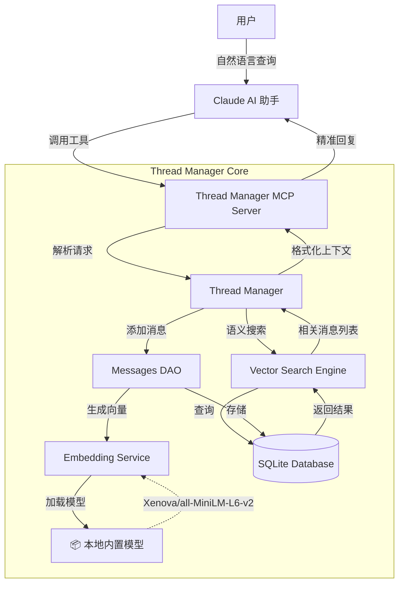
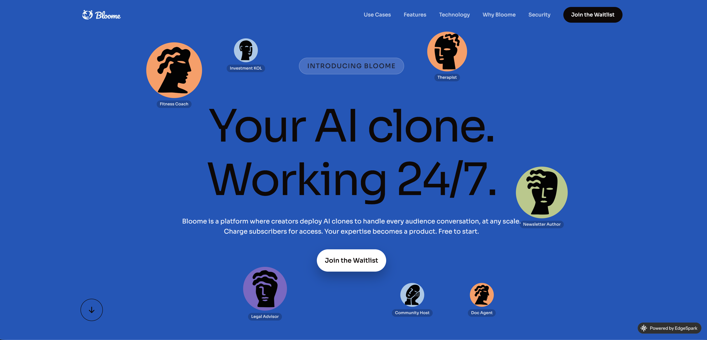
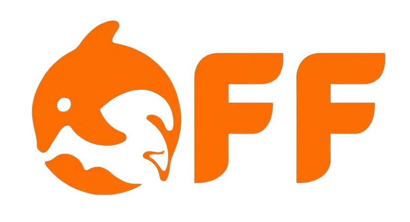

# AI Agent Team

> 💛 Sponsored by [DolOffer](https://doloffer.com?utm_source=ai-agent-team) — GPT & Claude 正版会员充值，输入优惠码 `AI8888` 享9折特惠

<div align="center">


**🚀 拥有24/7专业AI开发团队：产品经理、全栈开发、前端开发、后端开发、测试工程师、DevOps工程师、技术负责人**

**💾 Thread Manager 让 AI 拥有记忆！** 语义搜索 | 任务线程管理 | 完整上下文恢复 | 自动 Git 版本控制

**⚡ 只需 3 步完成安装** → 马上开始使用！

</div>

## Agent Skills（独立安装）

这些 Skill 已发布为独立仓库，可通过 `skills install` 命令安装到任意项目中：

| Skill | 安装方式 | 说明 |
|-------|---------|------|
| **[Tech Leader](https://github.com/peterfei/ai-agent-tech-leader)** | `npx skills install peterfei/ai-agent-tech-leader` | 架构决策、代码审查、技术管理、跨运行时兼容 |
| **[Product Manager](https://github.com/peterfei/ai-agent-product-manager)** | `npx skills install peterfei/ai-agent-product-manager` | 需求分析、路线图制定、竞品研究、用户故事编写 |
| **[Frontend Dev](https://github.com/peterfei/ai-agent-frontend-dev)** | `npx skills install peterfei/ai-agent-frontend-dev` | UI 组件开发、性能优化、可访问性、响应式设计 |
| **[Backend Dev](https://github.com/peterfei/ai-agent-backend-dev)** | `npx skills install peterfei/ai-agent-backend-dev` | API 设计、数据库优化、认证授权、服务端架构 |
| **[QA Engineer](https://github.com/peterfei/ai-agent-qa-engineer)** | `npx skills install peterfei/ai-agent-qa-engineer` | 测试策略、自动化测试、质量保证、CI 集成 |
| **[DevOps Engineer](https://github.com/peterfei/ai-agent-devops-engineer)** | `npx skills install peterfei/ai-agent-devops-engineer` | CI/CD 流水线、K8s 编排、IaC、可观测性 |
| **[Fullstack Engineer](https://github.com/peterfei/ai-agent-fullstack-engineer)** | `npx skills install peterfei/ai-agent-fullstack-engineer` | 前后端一体化、API 集成、端到端功能实现 |

兼容 Claude Code / Cursor / Codex CLI / Gemini CLI / Windsurf 等 50+ 运行时。

## 🚀 快速开始

### ✨ 核心特性

- 🎯 **八大专业智能体** - 产品经理、全栈开发、前端开发、后端开发、测试工程师、DevOps工程师、技术负责人
- 🧠 **Thread Manager** - AI 记忆系统，语义搜索，任务线程管理，自动 Git 版本控制
- 📝 **Changelog Generator** - 智能变更日志生成，自动版本管理，GitHub Release 集成
- 📜 **SoftCopyright** - 智能软著材料生成，一键生成软件著作权申请文档
- 🧹 **TidyMyDesktop** - 智能桌面整理，文件分类，版本去重，安全整理
- 🎨 **DrawNote** - 智能笔记可视化，多彩风格模板，一键生成精美图片
- ⚡ **原生集成** - 完全基于 Claude Code 原生智能体系统，支持自定义扩展

### 系统要求

- Claude Code (已安装并配置)
- Git

### 快速使用

```bash
# 🧹 整理桌面 - 帮我整理桌面
# 🎨 生成信息图 - 请帮我创建一个关于"人工智能发展历程"的信息图

# 🤖 调用智能体
/pm "设计用户认证系统"   # 产品经理
/fe "创建登录页面"       # 前端开发
/be "实现JWT认证接口"    # 后端开发
/qa "测试认证流程"       # 测试
/ops "部署到生产环境"    # DevOps
/tl "评估系统架构"       # 技术负责人
```

**详细文档**: 查看 [.claude/skills/drawnote/SKILL.md](.claude/skills/drawnote/SKILL.md)

---

## 🌟 v2.0.1 架构概览



---

## 📦 安装指南

```bash
# 第 1 步：安装
npm install -g ai-agent-team

# 第 2 步：初始化（必须执行）
ai-agent-team init                    # 全局初始化（推荐）
# 或 cd your-project && ai-agent-team init   # 项目本地初始化

# 第 3 步：启用 Thread Manager MCP 服务器（关键步骤）
claude mcp add thread-manager node "/你的路径/.claude/skills/thread-manager/dist/index.js"
```

> 不执行第 3 步将无法使用 `/threads`、`/pm-start` 等线程管理命令

#### ✅ 验证安装

```bash
/threads          # 查看所有线程
/pm-start "测试"  # 创建测试线程
/thread info      # 查看当前线程
```

<div>
<details>
<summary>全局 vs 项目本地初始化对比</summary>
| 特性 | 全局初始化 | 项目本地初始化 |
|------|-----------|---------------|
| 配置位置 | `~/.claude/` | `./.claude/` |
| 适用范围 | 所有项目 | 仅当前项目 |
| 推荐场景 | 个人开发者 | 团队项目 |
</details>

---

### Sponsors
<div align="center">



不想折腾本地配置？用 Bloome 即可快速跑起这支 AI 开发团队——把 PM、前端、后端、测试这些 agent 直接拉进一个群聊，人和 agent 在同一个对话里分工协作、共享上下文，全程云端、无需本地安装。原生支持接入 Claude Code、Codex 等主流 agent，开箱即用。

💡 **立即体验**：[Bloome](https://bloome.im/join/PlduOHMm?ref=iIevdIC2)

</div>

### ❓ 常见问题

<details>
<summary><b>/threads 命令不可用？</b></summary>
未启用 Thread Manager MCP 服务器。执行 `claude mcp add thread-manager node /path/to/thread-manager/dist/index.js` 并重启。
</details>

<details>
<summary><b>如何验证 Thread Manager 正常运行？</b></summary>
运行 `/threads`、`/thread info` 或 `/pm-start "测试线程"`，有输出即正常。
</details>

<details>
<summary><b>全局和项目配置可以同时使用吗？</b></summary>
可以。Claude Code 优先使用项目本地配置（`./.claude/`），不存在则使用全局配置（`~/.claude/`）。
</details>
</div>


---

## 🧠 Thread Manager - AI 团队的记忆系统

> [查看 v2.0.1 详细发布说明](./RELEASE_NOTES_v2.0.1.md)

### 🚀 核心亮点

<table>
<tr>
<td width="33%">

#### 💾 持久化记忆
- ✅ 语义搜索历史消息
- ✅ 对话永久保存
- ✅ 随时恢复上下文
- ✅ 多任务并行管理

</td>
<td width="33%">

#### 🌿 Git 自动集成
- ✅ 自动创建任务分支
- ✅ 文件变更追踪
- ✅ 代码统计分析
- ✅ 完整版本控制

</td>
<td width="34%">

#### 🎯 智能体快启
- ✅ `/pm-start` 产品设计
- ✅ `/fe-start` 前端开发
- ✅ `/be-start` 后端开发
- ✅ `/qa-start` 质量保证

</td>
</tr>
</table>

### 📊 Thread Manager vs 原生 Claude

| 功能 | 原生 Claude | Thread Manager | 提升 |
|------|------------|----------------|------|
| **上下文记忆** | ❌ 重启丢失 | ✅ 永久保存 | ∞ |
| **多任务管理** | ❌ 单线程 | ✅ 无限并行 | 10x+ |
| **任务恢复** | ❌ 无法恢复 | ✅ 完整恢复 | 新增 |
| **版本控制** | ⚠️ 手动 | ✅ 自动 | 3x |
| **工作效率** | 100% | **200%+** | **2x** |

### 🎮 基础使用

<details>
<summary>点击展开使用示例和命令</summary>
```bash
/pm-start "设计电商购物车功能"   # 创建任务线程
/be-start "实现购物车 API"       # 多任务并行
/thread switch abc123            # 切换线程（完整恢复）
```
| 命令 | 功能 |
|------|------|
| `/threads` | 查看所有线程 |
| `/thread switch <id>` | 切换线程 |
| `/pm-start "任务"` | 产品经理线程 |
| `/fs-start "任务"` | 全栈开发线程 |
| `/fe-start "任务"` | 前端开发线程 |
| `/be-start "任务"` | 后端开发线程 |
| `/qa-start "任务"` | QA 测试线程 |
**应用场景**：长期项目管理（数月对话完整恢复）、团队协作共享（通过线程 ID 恢复上下文）
</details>

---

## 📝 Changelog Generator Skill

<details>
<summary><b>智能变更日志生成器</b> — 自动分析 Git 历史，生成 CHANGELOG.md，支持语义化版本、HTML 输出、GitHub Release 集成（点击展开）</summary>

```bash
changelog-generate generate --all --format html   # 生成 HTML 变更日志
changelog-generate release --github-release       # 发布版本 + GitHub Release
changelog-generate update                         # 增量更新
```
- 零配置启动，开箱即用
- 从 Git 历史到 GitHub Release 一键完成
- 支持 Markdown / HTML 多格式输出
</details>

---

## 📜 SoftCopyright Skill

<details>
<summary><b>智能软著材料生成工具</b> — 一键生成符合软著申请要求的软件说明书和源代码文档（点击展开）</summary>
自动分析项目源码，生成软件说明书和源代码文档（每页50行，60页），支持注释清理、PDF 导出。
**简单三步**：说"帮我生成软著" → Claude 自动扫描生成 HTML → 浏览器打印 PDF
- 支持 20+ 语言（JavaScript、Python、Java、Go 等）
- 智能注释清理、版本自动识别
- 页数自动控制（≤60页全显，>60页前后各30页）
</details>

---

## 🧹 TidyMyDesktop Skill

<details>
<summary><b>智能桌面整理工具</b> — 自动分类文件、去重版本、安全整理桌面和目录（点击展开）</summary>
智能分类（应用程序/文档/图片/视频），自动识别版本号保留最新，dry-run 预览安全执行。
- "帮我整理桌面" → 自动扫描 → 生成计划 → 确认 → 执行 → 报告
- 跨平台支持 macOS / Windows / Linux
- semver 版本识别，智能去重
</details>


## 🎨 DrawNote Skill

<details>
<summary><b>智能笔记可视化工具</b> — 将文字内容转换为精美图片，支持 5 种风格模板（点击展开）</summary>
AI 自动分析内容，生成结构化的可视化笔记，支持彩色手写笔记、专业商务、科技创新、自然清新、现代简约 5 种风格。
- "请帮我创建一个关于'人工智能发展历程'的信息图"
- 内置模板系统，无需外部文件
- 自动保存 HTML + PNG
</details>

---

## 📋 智能体角色

| 角色 | 命令 | 职责 |
|------|------|------|
| 产品经理 | `/pm` | 产品规划、需求分析、用户研究 |
| 前端开发 | `/fe` | UI 实现、组件开发、性能优化 |
| 后端开发 | `/be` | API 设计、数据库优化、服务端逻辑 |
| 全栈开发 | `/fs` | 前后端一体化、API 集成、端到端交付 |
| 测试工程师 | `/qa` | 功能测试、自动化测试、质量保证 |
| DevOps 工程师 | `/ops` | 部署运维、CI/CD、基础设施 |
| 技术负责人 | `/tl` | 技术决策、架构设计、代码审查 |

## 💼 工作流程示例

```bash
# 完整产品开发流程
/pm "分析用户认证系统需求，包括功能规格、用户故事和验收标准"
/tl "设计用户认证系统的技术架构，包括前后端分离、JWT认证、数据库设计"
/be "实现JWT认证API，包括登录、注册、token刷新功能"
/fe "创建React登录组件，包含表单验证、错误处理和响应式设计"
/qa "设计用户认证系统的完整测试用例，包括功能测试和安全测试"
/ops "配置用户认证系统的生产环境部署，包括Docker容器化和CI/CD流水线"
```

## 🛠️ CLI 工具

```bash
# macOS / Linux
./.claude/agents/cli.sh pm "设计用户认证系统"

# Windows PowerShell
.\.claude\agents\cli.ps1 pm "设计用户认证系统"
```

## 📁 项目结构

```
ai-agent-team/
├── .claude/
│   ├── agents/         # 7 个智能体配置文件 + cli.sh
│   ├── commands/       # 快捷命令 (pm, fe, be, qa, ops, tl)
│   ├── skills/         # 内置 Skill（drawnote, tidymydesktop 等）
│   ├── CLAUDE.md
│   └── settings.local.json
├── bin/                # CLI 入口
├── package.json
├── README.md
└── LICENSE
```
## ❓ 常见问题


<details>
<summary><b>为什么包体积增大了？</b></summary>
Thread Manager 所需的向量嵌入模型 (Xenova/all-MiniLM-L6-v2) 已内置到安装包中，确保完全离线运行。包体积从 200KB 增至 16-25MB。
</details>

<details>
<summary><b>会消耗太多 Token 吗？</b></summary>
采用分层记忆架构：语义搜索精准检索、线程切换重置上下文、精简注入关键摘要、按需加载完整历史。
</details>

<details>
<summary><b>智能体无响应怎么办？</b></summary>
`claude --version` → `ls ~/.claude/agents/` → 重装配置
</details>

<details>
<summary><b>支持哪些语言和框架？</b></summary>
前端 React/Vue/Angular/Svelte，后端 Node.js/Python/Java/Go/PHP，数据库 MySQL/PostgreSQL/MongoDB/Redis，云服务 AWS/Azure/GCP/阿里云。
</details>


## 🤝 贡献指南

Fork → `git checkout -b feature/xxx` → commit → push → Pull Request

## 📄 许可证

[MIT License](LICENSE)

## 📝 更新日志

[CHANGELOG.md](CHANGELOG.md) | [v1.0.2](RELEASE_NOTES_1.0.2.md) | [v1.0.1](RELEASE_NOTES_1.0.1.md)

## 📞 联系我们

- 📧 Email: [peterfeispace@gmail.com](mailto:peterfeispace@gmail.com)
- 🐛 Issues: [GitHub Issues](https://github.com/peterfei/ai-agent-team/issues)
- 💬 Discussions: [GitHub Discussions](https://github.com/peterfei/ai-agent-team/discussions)

---

## ❤️ Sponsors

<div align="center">

### [DolOffer](https://doloffer.com?utm_source=ai-agent-team)

[](https://doloffer.com?utm_source=ai-agent-team)

**Doloffer Guide** 致力于让优质 AI 工具的获取更简单。平台主打 GPT 与 Claude 等主流 AI 服务的正版会员充值，提供一站式订阅管理，主打安全稳定与无忧售后。

💡 **极速订阅**：[doloffer.com](https://doloffer.com)（输入优惠码 `AI8888` 享9折特惠）

</div>

---

<div align="center">
**⭐ 如果这个项目对您有帮助，请给我们一个Star！⭐**

Made with ❤️ by AI Agent Team

</div>
