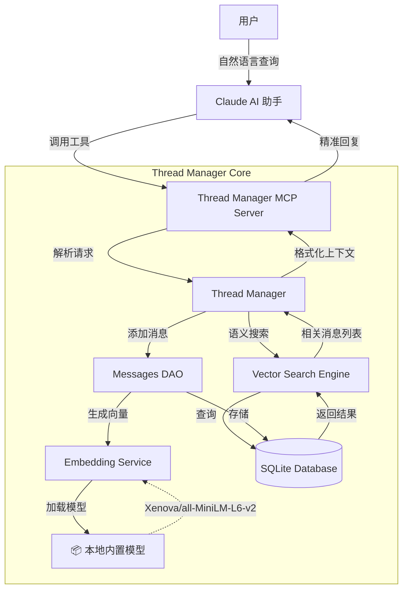
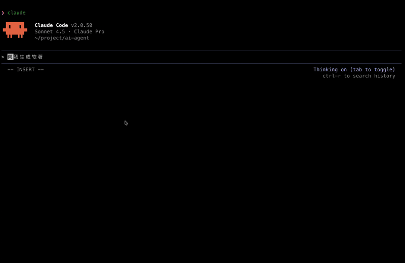
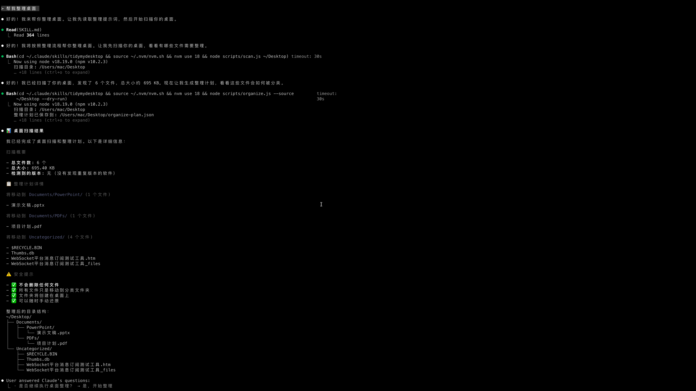
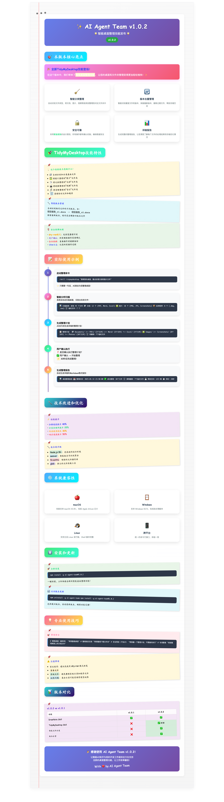
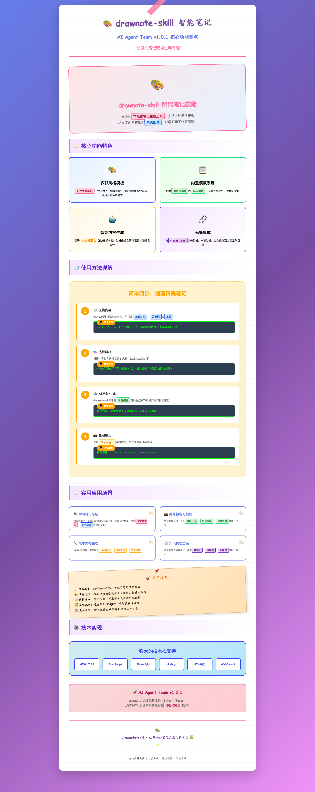

# AI Agent Team

> 💛 Sponsored by [DolOffer](https://doloffer.com?utm_source=ai-agent-team) — GPT & Claude 正版会员充值，输入优惠码 `AI8888` 享9折特惠

<div align="center">


**🚀 拥有24/7专业AI开发团队：产品经理、全栈开发、前端开发、后端开发、测试工程师、DevOps工程师、技术负责人**

**💾 Thread Manager 让 AI 拥有记忆！** 语义搜索 | 任务线程管理 | 完整上下文恢复 | 自动 Git 版本控制

**⚡ 只需 3 步完成安装** → 马上开始使用！

</div>

---

## 🌟 v2.0.1 架构概览



---

## 📦 安装指南

### 快速安装（3 步完成）

> **⚠️ 重要**：v2.0.0 引入 Thread Manager 记忆系统，需要完成以下 3 个步骤才能使用完整功能！

```
┌─────────────────────────────────────────────────┐
│  第 1 步: npm install -g ai-agent-team         │
│  ↓ 安装 AI 智能体团队                          │
└─────────────────────────────────────────────────┘
                      ↓
┌─────────────────────────────────────────────────┐
│  第 2 步: ai-agent-team init                   │
│  ↓ 初始化配置（全局或项目）                    │
└─────────────────────────────────────────────────┘
                      ↓
┌─────────────────────────────────────────────────┐
│  第 3 步: claude mcp add thread-manager        │
│  ↓ 启用 Thread Manager MCP 服务器              │
└─────────────────────────────────────────────────┘
                      ↓
              ✅ 安装完成！
```

#### 第 1 步：安装 AI Agent Team

```bash
npm install -g ai-agent-team
```

#### 第 2 步：初始化配置 ⭐ **必须执行**

**选择 A：全局初始化（推荐 - 所有项目共享）**

```bash
ai-agent-team init
```

这将在 `~/.claude/` 创建全局配置，所有项目都可使用 AI 智能体团队。

**选择 B：项目本地初始化（项目独立配置）**

```bash
cd your-project
ai-agent-team init
```

这将在项目的 `.claude/` 创建本地配置，仅当前项目可用。

#### 第 3 步：启用 Thread Manager MCP 服务器 ⭐ **关键步骤**

```bash
claude mcp add thread-manager node "/YOURSELFPROJECTPATH/.claude/skills/thread-manager/dist/index.js"
```


**为什么需要这一步？**

- Thread Manager 作为 MCP 服务器运行，提供持久化记忆功能
- 只需配置一次，永久生效
- 不执行此步骤将无法使用 `/threads`、`/pm-start` 等线程管理命令

#### ✅ 验证安装

重启 Claude Code 后测试：

```bash
# 1. 查看所有线程
/threads

# 2. 创建第一个任务线程
/pm-start "我的第一个任务"

# 3. 查看当前线程信息
/thread info
```

如果看到线程列表输出，说明安装成功！🎉

---

### 🎯 两种初始化方式对比

| 特性 | 全局初始化 | 项目本地初始化 |
|------|-----------|---------------|
| **配置位置** | `~/.claude/` | `./.claude/` |
| **适用范围** | 所有项目 | 仅当前项目 |
| **团队协作** | 个人使用 | 可提交到 Git |
| **数据隔离** | 共享线程数据 | 项目独立线程 |
| **推荐场景** | 个人开发者 | 团队项目 |

**💡 提示**：大多数情况推荐使用**全局初始化**，除非你需要在不同项目间完全隔离线程数据。

---


### ❓ 常见问题

<details>
<summary><b>Q: 为什么 /threads 命令不可用？</b></summary>

**原因**：未启用 Thread Manager MCP 服务器

**解决**：

```bash
# 1. 执行 MCP 服务器配置
claude mcp add thread-manager node "/YOURSELFPROJECTPATH/.claude/skills/thread-manager/dist/index.js"

# 2. 重启 Claude Code
exit
claude

# 3. 验证
/threads
```
</details>

<details>
<summary><b>Q: 如何查看 Thread Manager 是否正常运行？</b></summary>

```bash
# 方法 1: 查看线程列表
/threads

# 方法 2: 查看当前线程
/thread info

# 方法 3: 创建测试线程
/pm-start "测试线程"
```

如果以上命令正常工作，说明 Thread Manager 运行正常。
</details>

<details>
<summary><b>Q: 可以同时使用全局和项目配置吗？</b></summary>

可以！Claude Code 会优先使用项目本地配置（`./.claude/`），如果不存在则使用全局配置（`~/.claude/`）。

这意味着你可以：
- 全局配置作为默认
- 特定项目使用独立配置
</details>

---

## 🧠 Thread Manager - AI 团队的记忆系统

> [查看 v2.0.1 详细发布说明](./RELEASE_NOTES_v2.0.1.md)

### 🚀 核心亮点

<table>
<tr>
<td width="33%">

#### 💾 持久化记忆
- ✅ 语义搜索历史消息
- ✅ 对话永久保存
- ✅ 随时恢复上下文
- ✅ 多任务并行管理

</td>
<td width="33%">

#### 🌿 Git 自动集成
- ✅ 自动创建任务分支
- ✅ 文件变更追踪
- ✅ 代码统计分析
- ✅ 完整版本控制

</td>
<td width="34%">

#### 🎯 智能体快启
- ✅ `/pm-start` 产品设计
- ✅ `/fe-start` 前端开发
- ✅ `/be-start` 后端开发
- ✅ `/qa-start` 质量保证

</td>
</tr>
</table>

### 📊 Thread Manager vs 原生 Claude

| 功能 | 原生 Claude | Thread Manager | 提升 |
|------|------------|----------------|------|
| **上下文记忆** | ❌ 重启丢失 | ✅ 永久保存 | ∞ |
| **多任务管理** | ❌ 单线程 | ✅ 无限并行 | 10x+ |
| **任务恢复** | ❌ 无法恢复 | ✅ 完整恢复 | 新增 |
| **版本控制** | ⚠️ 手动 | ✅ 自动 | 3x |
| **工作效率** | 100% | **200%+** | **2x** |

### 🎮 基础使用

**创建任务线程（自动初始化角色）**

```bash
/pm-start "设计电商购物车功能"
  ↓ 自动创建产品线程
  ↓ AI 立即以产品经理身份分析需求
  ↓ 对话历史永久保存
```

**多任务并行开发**

```bash
/be-start "实现购物车 API"      # 线程 1: 后端开发
/fe-start "设计购物车UI"         # 线程 2: 前端开发
/qa-start "测试购物车功能"       # 线程 3: QA 测试

/threads                        # 查看所有线程进度
```

**切换线程（完整上下文恢复）**

```bash
/thread switch abc123
  ↓ AI 立即加载线程 abc123 的所有历史对话
  ↓ 文件变更、代码统计一并恢复
  ↓ 就像从未离开过这个任务
```

### 💡 核心命令

| 命令 | 功能 | 示例 |
|------|------|------|
| `/threads` | 查看所有线程 | 列出任务、消息数、文件变更 |
| `/thread switch <id>` | 切换线程 | 完整恢复历史上下文 |
| `/pm-start "任务"` | 产品经理线程 | 创建线程 + 需求分析 |
| `/fs-start "任务"` | 全栈开发线程 | 创建线程 + 前后端一体开发 |
| `/fe-start "任务"` | 前端开发线程 | 创建线程 + UI 开发 |
| `/be-start "任务"` | 后端开发线程 | 创建线程 + API 开发 |
| `/qa-start "任务"` | QA 测试线程 | 创建线程 + 执行测试 |

### 🔥 实际应用场景

- **长期项目管理**：项目跨度数月，AI 完整恢复数月前的对话上下文
- **团队协作共享**：多开发者通过线程 ID 恢复完整上下文

---

## 📝 Changelog Generator Skill - 智能变更日志生成器

```bash
# 1. 快速生成 HTML 格式变更日志
changelog-generate generate --all --format html

# 2. 发布新版本并创建 GitHub Release
changelog-generate release --github-release

# 3. 增量更新
changelog-generate update
```

### 💡 为什么选择它？

- **零配置启动**：内置最佳实践配置，开箱即用
- **完全自动化**：从 Git 历史到 GitHub Release，一键完成
- **专业级输出**：不仅是 Markdown，更能生成交互式 HTML 报告
- **高度可定制**：通过 Handlebars 模板完全掌控输出格式

---

## 📜 SoftCopyright Skill - 智能软著材料生成工具

> **✨ 一键生成软件著作权申请材料，让软著申请变得简单高效！**

### 🌟 核心功能特色

| 📋 智能项目分析 | 📄 HTML文档生成 | 🔄 版本自动识别 | 🖨️ 完美打印支持 |
|-------------|--------------|--------------|-------------|
| 自动识别项目类型、技术栈和架构模式 | 生成符合要求的**软件说明书**和**源代码文档** | 从package.json等配置文件**自动读取版本号** | 支持浏览器打印为PDF，页眉页脚自动添加 |
| 支持**README解析**，无package.json时智能识别项目 | **每页50行代码**，符合软著页数要求 | 支持**多语言项目**（JavaScript、Python、Java等） | **智能注释清理**，只保留有效代码 |



### 🎯 软著申请完全支持

#### 核心功能
- **✅ 软件说明书**：自动生成2000-3000字详细说明书，包含项目概述、功能模块、技术架构等
- **✅ 源代码文档**：自动生成60页源代码文档，每页50行，完全符合软著申请要求
- **✅ 智能页数控制**：≤60页完整显示，>60页显示前30页+后30页，中间省略
- **✅ 注释自动清理**：自动移除单行注释、多行注释、空白行、版权声明等
- **✅ 中文完美支持**：原生HTML格式，中文显示无乱码，打印支持

#### 技术规格
- **源码展示格式**：每页50行，自动分页，行号显示
- **注释处理规则**：
  - 多行注释：`/\*(.|\r\n|\n)*?\*/`
  - 单行注释：`//.*`
  - 空白行：`^\s*(?=\r?$)\n`
  - 版权声明：自动移除copyright、author、license等
- **支持语言**：JavaScript、Python、Java、C、C++、Go、Rust、Swift、Kotlin等20+语言

### 💡 使用方法详解

#### 简单三步，生成专业软著材料

1. **📊 扫描分析项目**
   ```bash
   用户: "帮我生成软著"
   Claude: 自动扫描项目 → 分析源码 → 识别技术栈 → 生成文档
   ```

2. **📄 生成申请材料**
   ```bash
   自动生成:
   - 软件说明书.html (符合要求的详细描述)
   - 源代码文档.html (60页，每页50行)
   - 版本信息自动识别 (从package.json、README等)
   ```

3. **🖨️ 导出PDF文档**
   ```bash
   浏览器打开HTML文件 → Cmd+P → 勾选"页眉和页脚" → 保存为PDF
   ```

#### 高级功能
- **项目路径指定**：支持任意目录的软著材料生成
- **输出目录自定义**：可指定生成文件的保存位置
- **README智能解析**：没有package.json时，从README读取项目名称和版本
- **批量处理**：支持多个项目同时生成软著材料

### 🎨 使用场景示例

#### Web开发项目
```bash
"帮我生成React电商系统的软著材料"
# 自动识别：
# - 项目类型：React + JavaScript前端
# - 技术栈：React、Redux、Webpack
# - 版本号：从package.json读取
# - 生成完整的软著申请文档
```

#### 后端项目
```bash
"生成Python Django项目的软著材料"
# 自动识别：
# - 项目类型：Python Django后端
# - 源码文件：.py、.html、.css等
# - 页数控制：按软著要求生成
# - 注释清理：移除Python注释和文档字符串
```

---

## 🧹 TidyMyDesktop Skill - 智能桌面整理工具

> **✨ 让您的桌面和目录焕然一新！智能分类、版本去重、安全整理**

### 🌟 核心功能特色

| 🎯 智能文件分类 | 🔄 版本自动去重 | 🔍 未知软件识别 | 🛡️ 安全整理保障 |
|--------------|---------------|----------------|----------------|
| **应用程序**、文档、图片、视频等自动分类 | 识别**软件版本号**，保留最新版本，清理旧版本 | 通过**网络搜索**识别不熟悉软件的用途 | **dry-run模式**预览，用户确认后执行 |
| 创建**分类文件夹**，整洁有序 | 智能比较版本新旧，避免误删 | 标记**需要人工审核**的项目 | 所有删除操作需要**明确确认** |

### 💡 实用整理场景

| 🏠 桌面整理 | 📁 目录整理 | 🧹 版本清理 | 📊 整理报告 |
|------------|------------|------------|------------|
| **一键整理桌面**，告别混乱文件 | **整理指定目录**，提高工作效率 | **自动识别软件版本**，清理冗余文件 | **生成详细报告**，记录整理过程 |

### 🛠️ 使用方法

#### 简单三步，智能整理

1. **🏠 整理桌面**
   ```bash
   用户: "帮我整理桌面"
   Claude: 自动扫描 → 生成计划 → 用户确认 → 执行整理 → 生成报告
   ```

2. **📁 整理目录**
   ```bash
   用户: "帮我整理当前目录"
   Claude: 确认路径 → 扫描分析 → 生成计划 → 用户确认 → 整理执行
   ```

3. **🔍 智能识别**
   ```bash
   自动识别文件类型、软件版本、未知用途
   提供整理建议，确保安全可靠
   ```

### 📂 智能分类规则

- **应用程序**: 开发工具、办公软件、设计工具、通讯工具、娱乐软件、系统工具
- **文档**: PDF文档、Word文档、Excel表格、文本文件
- **媒体文件**: 图片（照片、截图、设计稿）、视频、音频
- **其他**: 压缩包、代码项目、未分类文件

### 📸 实际效果展示



*TidyMyDesktop Skill 实际整理效果截图 - 展示了智能分类和整理的结果*

#### 📝 v1.0.2 彩色手写笔记版本说明



*AI Agent Team v1.0.2 彩色手写笔记风格版本说明 - 详细介绍新增的TidyMyDesktop功能和特性*

### ⚡ 技术特性

- **跨平台支持**: macOS、Windows、Linux
- **Node.js驱动**: 高性能文件操作
- **智能算法**: 版本号识别（semver）
- **安全机制**: dry-run模式，完整备份提醒
- **详细报告**: Markdown格式，包含整理统计


## 🎨 DrawNote Skill - 智能笔记可视化工具

> **✨ 让您的笔记变得生动有趣！将文字内容转换为精美图片**

### 🌟 核心功能特色

| 🎨 多彩风格模板 | 📋 内置模板系统 | 🤖 智能内容生成 | 🔗 无缝集成 |
|--------------|--------------|--------------|----------|
| **彩色手写笔记**、专业商务、科技创新、自然清新等多种风格 | 内置**提示词模板**和**样式模板**，无需外部文件 | 基于**AI大模型**，自动分析内容并生成最适合的笔记结构 | 与**Claude Code**完美集成，一键生成，自动保存 |

### 📝 使用方法详解

#### 简单四步，创建精美笔记

1. **📝 提供内容**
   ```bash
   skill: "drawnote"
   内容: "人工智能发展历程" 或具体笔记内容
   ```

2. **🎨 选择风格**
   ```bash
   "请使用彩色手写笔记风格" 或 "请生成学习笔记风格的信息图"
   ```

3. **🤖 AI自动生成**
   ```bash
   自动保存: drawnote_YYYYMMDD_HHMMSS.html
   ```

4. **📸 截图输出**
   ```bash
   自动保存: drawnote_YYYYMMDD_HHMMSS.png
   ```

### 💡 实用应用场景

| 📚 学习笔记总结 | 💼 商务报告可视化 | 🔧 技术文档整理 | 📊 知识梳理总结 |
|--------------|----------------|--------------|---------------|
| **荧光笔高亮**、彩色标注等学习元素 | **数据分析**、项目报告、战略规划 | **技术架构**、API文档、开发指南 | **时间线**、流程图、对比表等形式 |

### 🎯 五种精美风格

1. **彩色手写笔记风格** ⭐ 推荐
   - 适用场景：学习笔记、读书总结、知识整理
   - 特点：温馨自然、易于记忆

2. **专业商务风格**（默认）
   - 适用场景：商业报告、数据分析、项目演示
   - 特点：简洁专业、数据驱动

3. **科技创新风格**
   - 适用场景：技术文档、产品介绍、创新展示
   - 特点：现代科技、未来感强

4. **自然清新风格**
   - 适用场景：环保主题、健康生活、自然科学
   - 特点：清新淡雅、亲和力强

5. **现代简约风格**
   - 适用场景：极简设计、艺术展示、高端品牌
   - 特点：简约大气、设计感强

### 📸 实际效果展示



*上图为 AI Agent Team v1.0.1 的 DrawNote Skill 实际生成效果，展示了核心功能和应用场景的 2x2 网格布局*

---

## 🚀 快速开始

### ✨ 核心特性

- 🎯 **七大专业智能体** - 产品经理、全栈开发、前端开发、后端开发、测试工程师、DevOps工程师、技术负责人
- 🧠 **Thread Manager** - AI 记忆系统，语义搜索，任务线程管理，自动 Git 版本控制
- 📝 **Changelog Generator** - 智能变更日志生成，自动版本管理，GitHub Release 集成
- 📜 **SoftCopyright** - 智能软著材料生成，一键生成软件著作权申请文档
- 🧹 **TidyMyDesktop** - 智能桌面整理，文件分类，版本去重，安全整理
- 🎨 **DrawNote** - 智能笔记可视化，多彩风格模板，一键生成精美图片
- ⚡ **原生集成** - 完全基于 Claude Code 原生智能体系统，支持自定义扩展

### 系统要求

- Claude Code (已安装并配置)
- Git

### 快速使用

#### 🧹 TidyMyDesktop Skill 使用示例

```bash
# 整理桌面 - 最常用的功能
帮我整理桌面

# 整理当前目录
帮我整理当前目录

# 整理指定目录（会要求确认路径）
帮我整理下载文件夹

# 智能整理建议
帮我分析一下这个目录的文件结构，给出整理建议

# 安全预览整理计划
帮我看一下整理桌面会执行哪些操作，不要真的执行

# 针对特定类型文件整理
帮我整理桌面上的应用程序文件
```

#### 🎨 DrawNote Skill 使用示例

```bash
# 基础使用
请帮我创建一个关于"人工智能发展历程"的信息图

# 指定风格
请使用彩色手写笔记风格生成"机器学习算法分类"的信息图

# 复杂内容
请创建一个关于"微服务架构设计模式"的流程图，使用科技创新风格

# 学习笔记
请用专业商务风格创建"React Hooks"的技术文档

# 知识总结
请创建一个关于"Python数据结构"的学习总结，使用自然清新风格
```

#### 🤖 AI 智能体使用示例

```bash
# 产品经理 - 需求分析
/pm "设计用户认证系统"

# 全栈开发 - 前后端一体
/fs "开发用户认证功能，包括注册、登录、个人中心"

# 前端开发 - UI实现
/fe "创建登录页面组件"

# 后端开发 - API开发
/be "实现JWT认证接口"

# 测试工程师 - 质量保证
/qa "测试用户认证流程"

# 运维工程师 - 部署运维
/ops "部署到生产环境"

# 技术负责人 - 架构设计
/tl "评估系统架构"
```

**详细文档**: 查看 [.claude/skills/drawnote/SKILL.md](.claude/skills/drawnote/SKILL.md)

## 📋 智能体角色

### 🎯 产品经理 (`/pm`)
- **职责**: 产品规划、需求分析、用户研究、竞品分析
- **专长**: 敏捷开发、路线图制定、利益相关者管理
- **使用场景**: 功能需求分析、产品规划、用户体验设计

### 🎨 前端开发 (`/fe`)
- **职责**: UI实现、组件开发、用户体验优化
- **专长**: React/Vue/Angular、响应式设计、性能优化
- **使用场景**: 页面开发、组件设计、前端架构

### ⚙️ 后端开发 (`/be`)
- **职责**: API设计、数据库优化、服务器端逻辑
- **专长**: Node.js/Python/Java、数据库设计、API架构
- **使用场景**: API开发、数据库设计、系统集成

### 🔗 全栈开发 (`/fs`)
- **职责**: 前后端一体化开发、API集成、端到端功能实现
- **专长**: Next.js/Nuxt、全栈TypeScript、数据库设计、API设计
- **使用场景**: 完整功能开发、前后端联调、MVP 快速交付

### 🧪 测试工程师 (`/qa`)
- **职责**: 功能测试、自动化测试、质量保证
- **专长**: 单元测试、集成测试、端到端测试
- **使用场景**: 测试设计、自动化测试、缺陷管理

### 🔧 DevOps工程师 (`/ops`)
- **职责**: 部署运维、基础设施、CI/CD流水线
- **专长**: Docker、Kubernetes、云服务、监控告警
- **使用场景**: 系统部署、运维监控、性能优化

### 👨‍💼 技术负责人 (`/tl`)
- **职责**: 技术决策、团队协调、架构设计
- **专长**: 系统架构、技术选型、团队管理
- **使用场景**: 架构评审、技术选型、团队规划

## 💼 工作流程示例

```bash
# 完整产品开发流程
/pm "分析用户认证系统需求，包括功能规格、用户故事和验收标准"
/tl "设计用户认证系统的技术架构，包括前后端分离、JWT认证、数据库设计"
/be "实现JWT认证API，包括登录、注册、token刷新功能"
/fe "创建React登录组件，包含表单验证、错误处理和响应式设计"
/qa "设计用户认证系统的完整测试用例，包括功能测试和安全测试"
/ops "配置用户认证系统的生产环境部署，包括Docker容器化和CI/CD流水线"
```

## 🛠️ CLI工具

项目包含跨平台CLI工具，提供更友好的命令行界面：

### macOS/Linux
```bash
# 使用CLI工具调用智能体
./.claude/agents/cli.sh pm "设计用户认证系统"
./.claude/agents/cli.sh 前端 "创建登录页面"
./.claude/agents/cli.sh backend "实现JWT API"
./.claude/agents/cli.sh 测试 "测试认证流程"
./.claude/agents/cli.sh 运维 "部署到生产环境"
```

### Windows PowerShell
```powershell
# 使用CLI工具调用智能体
.\.claude\agents\cli.ps1 pm "设计用户认证系统"
.\.claude\agents\cli.ps1 fe "创建登录页面"
.\.claude\agents\cli.ps1 be "实现JWT API"
.\.claude\agents\cli.ps1 qa "测试认证流程"
.\.claude\agents\cli.ps1 ops "部署到生产环境"
```

CLI工具特性：
- 🎨 彩色输出界面
- 🔍 智能体名称映射（支持中英文）
- 💡 下一步建议
- ❌ 错误处理和帮助信息
- 📊 调试模式支持

## 📁 项目结构

```
ai-agent-team/
├── .claude/
│   ├── agents/                  # 智能体配置文件
│   │   ├── product_manager.md   # 产品经理智能体
│   │   ├── fullstack_dev.md     # 全栈开发智能体
│   │   ├── frontend_dev.md      # 前端开发智能体
│   │   ├── backend_dev.md       # 后端开发智能体
│   │   ├── qa_engineer.md       # 测试工程师智能体
│   │   ├── devops_engineer.md   # 运维工程师智能体
│   │   ├── tech-leader.md       # 技术负责人智能体
│   │   └── cli.sh              # CLI工具脚本
│   ├── commands/               # 快捷命令配置
│   │   ├── pm.md              # 产品经理快捷命令
│   │   ├── fe.md              # 前端开发快捷命令
│   │   ├── be.md              # 后端开发快捷命令
│   │   ├── qa.md              # 测试工程师快捷命令
│   │   ├── ops.md             # 运维工程师快捷命令
│   │   ├── tl.md              # 技术负责人快捷命令
│   │   └── README.md          # 命令说明文档
│   ├── skills/               # 智能技能集合
│   │   ├── drawnote/         # DrawNote智能笔记技能
│   │   │   ├── scripts/      # 脚本文件
│   │   │   ├── styles/       # 风格模板
│   │   │   ├── SKILL.md      # 技能说明
│   │   │   └── package.json  # 依赖配置
│   │   └── tidymydesktop/    # TidyMyDesktop桌面整理技能
│   │       ├── scripts/      # 整理脚本（scan, organize, classify）
│   │       ├── tidy-*        # 可执行工具脚本
│   │       ├── SKILL.md      # 技能说明文档
│   │       ├── TEST_REPORT.md # 测试报告
│   │       └── package.json  # 依赖配置
│   ├── CLAUDE.md              # 项目说明文档
│   └── settings.local.json   # 本地配置文件
├── docs/                      # 文档目录
│   └── BEST_PRACTICES.md      # 最佳实践指南
├── examples/                  # 示例项目和截图
│   ├── web-app/               # Web应用开发示例
│   └── tidymydesktop.png      # TidyMyDesktop效果截图
├── scripts/                   # 辅助脚本
│   └── install.sh            # 安装脚本
├── bin/                       # 可执行文件
│   └── ai-agent-team.js      # CLI工具
├── install.sh                 # Shell安装脚本 (macOS/Linux)
├── install.ps1                # PowerShell安装脚本 (Windows)
├── install.bat                # 批处理安装脚本 (Windows)
├── test-windows-compatibility.ps1  # Windows兼容性测试脚本
├── package.json               # npm包配置
├── README.md                  # 项目说明
├── LICENSE                    # 开源许可证
├── CONTRIBUTING.md            # 贡献指南
└── CHANGELOG.md               # 更新日志

## 📦 npm包信息

- **包名**: `ai-agent-team`
- **版本**: 1.0.2
- **安装**: `npm install -g ai-agent-team`
- **npm页面**: https://www.npmjs.com/package/ai-agent-team

## 🎯 使用场景

- **个人开发者**：快速原型开发、全栈项目、技术学习
- **初创团队**：MVP 快速开发、团队协作规范、技术选型
- **企业开发**：标准化流程、新人培训、最佳实践推广
- **教育培训**：编程教学、项目实战、团队协作训练

## 📈 最佳实践

- **清晰的任务描述**：提供具体、可操作的需求，避免模糊描述
- **提供上下文**：包含项目背景和技术约束，帮助智能体做出正确决策
- **迭代开发**：复杂功能分阶段实施，逐步完善
- **团队协作**：确保智能体间的工作协调，前后端对齐

## 🔧 高级配置

### 自定义智能体

1. 创建智能体配置文件：
```bash
cp .claude/agents/product_manager.md .claude/agents/custom_agent.md
```

2. 编辑配置文件，修改角色和能力
3. 创建对应的快捷命令：
```bash
cp .claude/commands/pm.md .claude/commands/custom.md
```

### 环境变量配置
```bash
# Claude Code配置
export CLAUDE_API_KEY="your-api-key"
export CLAUDE_MODEL="claude-3-sonnet"

# 智能体配置
export AGENT_TIMEOUT=300
export AGENT_MAX_TOKENS=4000
```

## 💻 Windows 支持

ai-agent-team 全面支持 Windows 10/11 系统，提供 PowerShell 和批处理安装方式（详见上方安装指南）。

**Q: PowerShell 执行策略限制？** `Set-ExecutionPolicy -ExecutionPolicy RemoteSigned -Scope CurrentUser`

**Q: 杀毒软件报误？** 将 `%USERPROFILE%\.claude\` 和安装目录添加到白名单。

## ❓ 常见问题

<details>
<summary><b>Q: 为什么 AI Agent Team 包体积增大了？</b></summary>

**A:** 为了解决国内网络环境下载模型慢或失败的问题，从 v2.0.1 版本开始，我们已将 **Thread Manager 所需的向量嵌入模型 (Xenova/all-MiniLM-L6-v2)** 直接内置到安装包中。

这确保了用户在安装 `ai-agent-team` 后，Thread Manager 的语义搜索功能可以**完全离线**运行，无需额外联网下载模型。

因此，安装包体积从大约 200KB 增加到 16-25MB 左右（取决于平台和打包工具），但这带来了更稳定、更快速的开箱即用体验。
</details>

<details>
<summary><b>Q: 上下文有优化吗？会消耗太多 Claude 的 Token 吗？</b></summary>

**A: 有针对性优化，不会造成浪费。**

Thread Manager v2.0.1 采用**分层记忆架构**，极大优化了 Token 效率：
- **精准检索**: 语义搜索允许 AI 精准提取只需的几条相关记忆，而不是加载整个对话历史，节省大量 Token。
- **任务隔离**: 切换线程时会重置上下文窗口，移除不相关的历史对话，只保留当前任务的关键信息。
- **精简注入**: 动态维护的 `current-context.md` 只包含最近的少量关键消息摘要和元数据。
- **按需加载**: 完整的历史记录存储在本地数据库中，只有在您主动搜索或请求时（Lazy Loading）才会检索。
</details>

<details>
<summary>智能体无响应怎么办？</summary>

1. 检查Claude Code是否正确安装：`claude --version`
2. 验证配置文件是否存在：`ls ~/.claude/agents/`
3. 测试基础功能：`claude -p "测试连接"`
4. 重新安装配置：`./scripts/install.sh`
</details>

<details>
<summary>如何提高任务完成质量？</summary>

1. 提供详细的任务描述和上下文
2. 分步骤分解复杂任务
3. 明确指定技术栈和约束条件
4. 提供示例和参考资料
</details>

<details>
<summary>支持哪些编程语言和框架？</summary>

智能体支持主流的编程语言和框架：
- 前端：React, Vue, Angular, Svelte等
- 后端：Node.js, Python, Java, Go, PHP等
- 数据库：MySQL, PostgreSQL, MongoDB, Redis等
- 云服务：AWS, Azure, GCP, 阿里云等
</details>

## 🤝 贡献指南

我们欢迎所有形式的贡献！

### 贡献方式

1. **报告问题** - 在Issues中提交bug报告或功能建议
2. **提交代码** - Fork项目并提交Pull Request
3. **完善文档** - 改进文档质量和完整性
4. **分享经验** - 分享使用案例和最佳实践

### 开发流程

1. Fork项目 (在 https://github.com/peterfei/ai-agent-team)
2. 创建功能分支：`git checkout -b feature/new-feature`
3. 提交更改：`git commit -m 'Add new feature'`
4. 推送分支：`git push origin feature/new-feature`
5. 创建Pull Request

## 📄 许可证

本项目采用 [MIT License](LICENSE) 开源许可证。

## 🙏 致谢

- 感谢 [Anthropic](https://anthropic.com) 提供强大的Claude Code平台
- 感谢所有贡献者和用户的支持和反馈
- 感谢开源社区的技术和灵感

## 📝 更新日志

查看详细的版本更新历史：
- **[CHANGELOG.md](CHANGELOG.md)** - 完整的版本更新记录
- **[v1.0.2 发布日志](RELEASE_NOTES_1.0.2.md)** - 最新版本的详细发布说明
- **[v1.0.1 发布日志](RELEASE_NOTES_1.0.1.md)** - 上一版本的发布说明

## 📞 联系我们

- 📧 Email: [peterfeispace@gmail.com](mailto:peterfeispace@gmail.com)
- 🐛 Issues: [GitHub Issues](https://github.com/peterfei/ai-agent-team/issues)
- 💬 Discussions: [GitHub Discussions](https://github.com/peterfei/ai-agent-team/discussions)

---

## ❤️ Sponsors

<div align="center">

### [DolOffer](https://doloffer.com?utm_source=ai-agent-team)

[](https://doloffer.com?utm_source=ai-agent-team)

**Doloffer Guide** 致力于让优质 AI 工具的获取更简单。平台主打 GPT 与 Claude 等主流 AI 服务的正版会员充值，提供一站式订阅管理，主打安全稳定与无忧售后。

💡 **极速订阅**：[doloffer.com](https://doloffer.com)（输入优惠码 `AI8888` 享9折特惠）

</div>

---

<div align="center">
**⭐ 如果这个项目对您有帮助，请给我们一个Star！⭐**

Made with ❤️ by AI Agent Team

</div>
