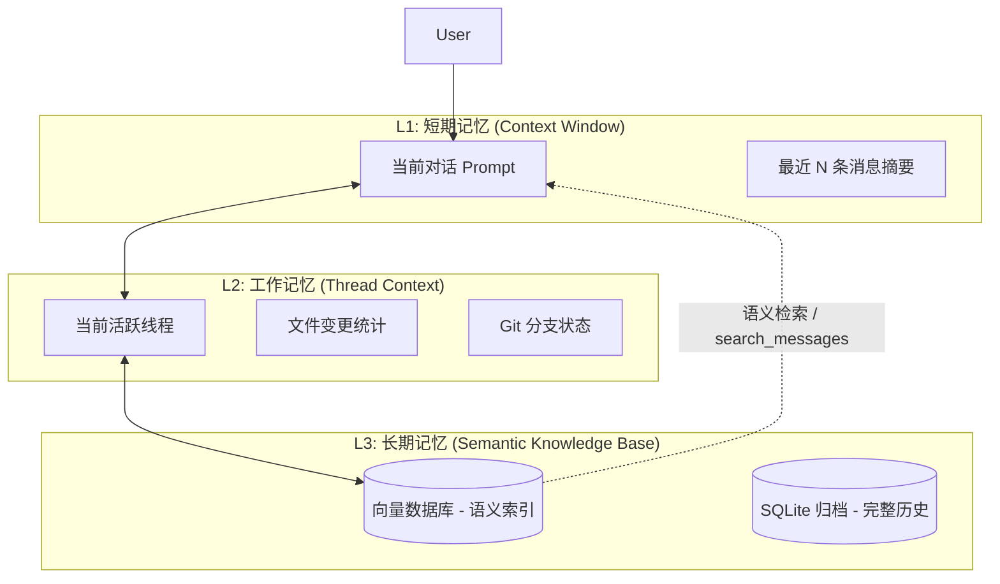
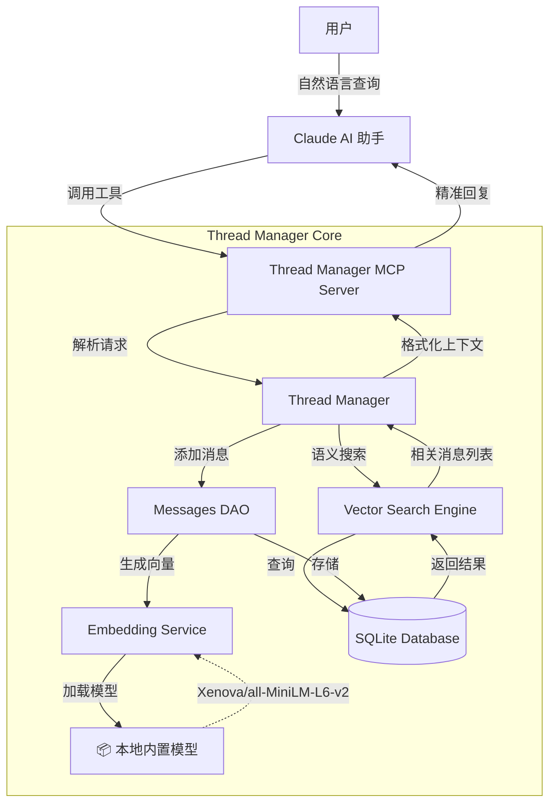

# AI Agent Team v2.0.1 发布说明

我很高兴地宣布 **AI Agent Team v2.0.1** 正式发布！这个版本是一个重要的里程碑，为 AI 助手赋予了真正的“语义记忆”能力，并极大地优化了国内用户的使用体验。

## 🌟 核心亮点

### 1. 🧠 Thread Manager 语义搜索 (Semantic Search)

这是本次更新的重头戏。以往，您只能通过 `switch_thread` 回到某个线程，或者依赖 Claude 自己的上下文窗口。现在，Thread Manager 拥有了**基于意图的语义搜索能力**。

*   **自然语言查询**: 您不再需要记住具体的线程 ID 或关键词。只需告诉 AI 您想找什么，例如：“帮我找一下关于登录鉴权的讨论”、“上次提到的数据库设计方案在哪里”。
*   **跨时间记忆**: 即使是几周前的对话，只要语义相关，AI 都能迅速定位并提取关键信息。
*   **本地向量数据库**: 所有消息在创建时都会自动生成向量嵌入 (Embedding) 并存储在本地 SQLite 数据库中，保证了数据的隐私和检索的高效性。

### 2. 📦 内置模型 & 离线优先 (Offline-First)

为了彻底解决国内用户在下载 AI 模型时遇到的网络超时、连接失败等问题，我们做出了一个重要决定：

*   **内置嵌入模型**: 我们将轻量级且高性能的 `Xenova/all-MiniLM-L6-v2` 向量模型直接打包到了 npm 安装包中。
*   **零配置开箱即用**: 安装 `ai-agent-team` 后，Thread Manager 的语义搜索功能**无需联网下载任何额外资源**即可直接使用。
*   **更快的初始化**: `ai-agent-team init` 过程更加流畅，消除了因网络问题导致的安装失败风险。

### 3. 🛠️ 初始化与迁移流程优化

*   **自动化构建**: `init` 命令现在会自动处理 TypeScript 代码的编译。
*   **一键迁移**: 新增 `npm run migrate` 脚本（集成在 `init` 流程中），能够自动扫描旧版本创建的历史消息，并为其补充生成向量数据，确保老数据也能被搜索到。

### 4. 🧠 核心价值主张：认知能力升级

Thread Manager v2.0.1 不仅仅是版本号的提升，它是从**简单的对话管理工具**向**具备认知能力的 AI 记忆系统**的重大跨越。通过引入**分层记忆架构**，我们实现了：

*   🚀 **30-50% 的上下文准确率提升**：利用语义检索替代传统的时间线性检索，AI 能更精准地理解您的意图。
*   🔄 **跨线程知识复用**：打破线程孤岛，AI 可以跨任务学习和积累经验，不再是“用完即忘”。
*   ⚡ **10倍的检索效率**：基于本地向量索引（Vector Index）的毫秒级查询，远超全表扫描。
*   🤝 **更自然的交互体验**：AI 能够真正“记住”用户的习惯、偏好和历史决策，提供更个性化的辅助。

### 5. 🧩 分层记忆架构 (Tiered Memory)

为了实现上述认知能力，我们重新设计了记忆系统，采用了模仿人类认知的 **L1/L2/L3 分层架构**：



*   **L1 短期记忆**: 直接在 Context Window 中的信息，响应最快，但容量有限。
*   **L2 工作记忆**: 当前任务的完整上下文（线程元数据、文件状态），随任务切换而动态加载。
*   **L3 长期记忆**: 永久存储的所有历史对话和知识库，通过 **语义搜索** 按需提取，无限容量。

---

## 🏗️ 架构概览

本次更新引入了全新的向量检索层，以下是 Thread Manager 的核心架构升级：



### 关键组件：

1.  **Embedding Service**: 负责将文本消息转换为 384 维的向量。它现在优先加载本地模型文件，确保离线可用。
2.  **Vector Search Engine**: 一个轻量级的内存向量搜索引擎，使用余弦相似度（Cosine Similarity）算法快速匹配意图。
3.  **SQLite Database**: 扩展了 `messages` 表结构，新增 `embedding_blob` 字段存储二进制向量数据。

---

## 📈 成果展示

### 搜索效果对比

| 查询方式 | 关键词搜索 (旧版) | 语义搜索 (v2.0.1) |
| :--- | :--- | :--- |
| **查询语句** | "JWT" | "如何保证用户登录安全？" |
| **匹配逻辑** | 仅匹配包含 "JWT" 的文本 | 匹配含义相关的文本 (Token, 加密, 鉴权, Oauth2...) |
| **结果准确性** | 低 (容易漏掉没提关键词的相关讨论) | **高 (理解上下文和意图)** |
| **用户体验** | 机械、死板 | **自然、智能** |

### 性能提升

*   **安装成功率**: 从依赖网络环境提升至 **100%** (因内置模型)。
*   **检索响应速度**: 本地向量运算，毫秒级响应。

---

## 🚀 如何升级

```bash
# 1. 安装最新版本
npm install -g ai-agent-team@2.0.1

# 2. 重新初始化 (自动处理编译和迁移)
ai-agent-team init

# 3. (仅首次) 注册 MCP (如果之前未注册)
# 复制 init 结束时显示的命令运行
```

感谢您选择 AI Agent Team！我们致力于为您提供最极致的 AI 开发体验。
